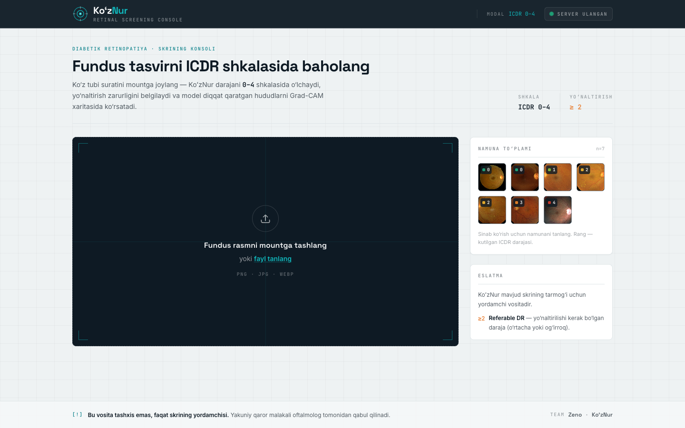
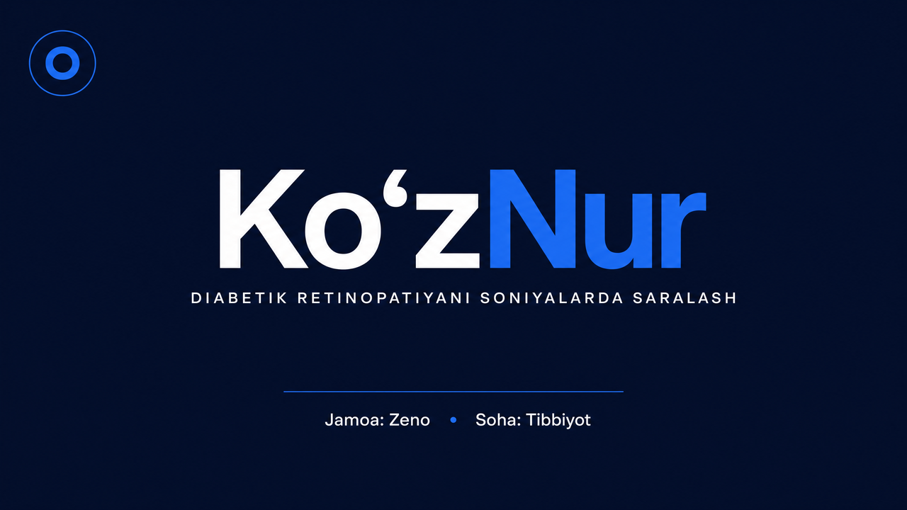
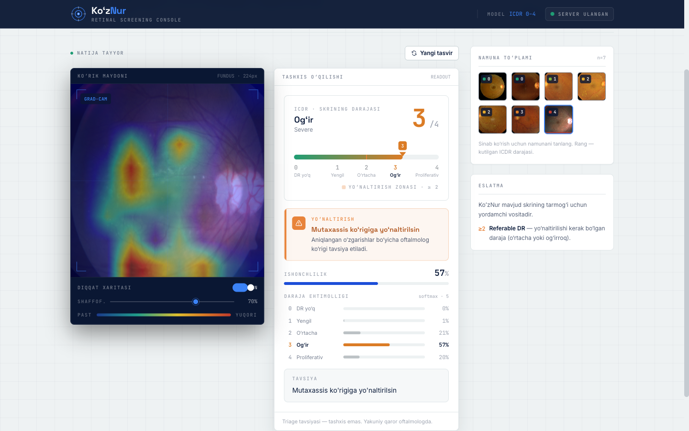
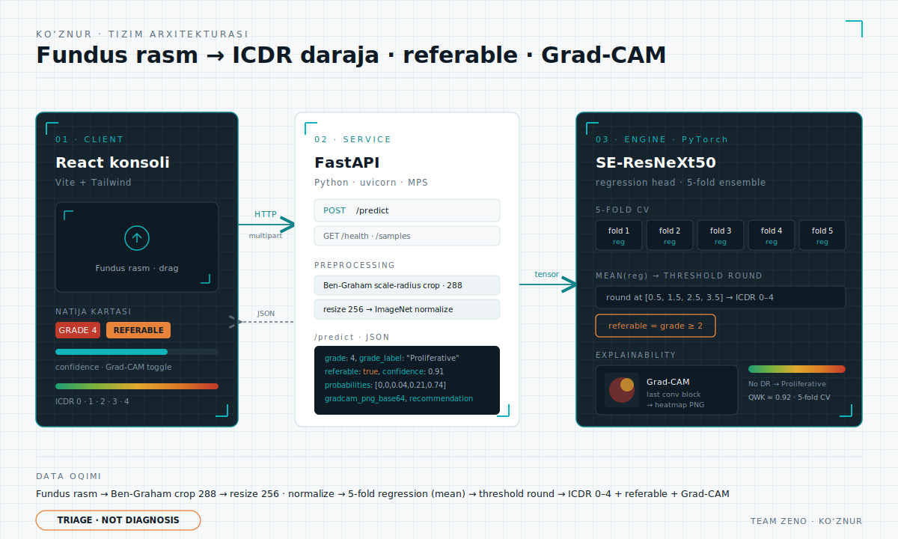

<div align="center">

<!-- Brendlar: display "Space Grotesk", data/raqamlar "JetBrains Mono", body "Inter" -->
<a href="https://fonts.google.com"></a>

# KoʻzNur

### Fundus rasmidan diabetik retinopatiyani sekundlarda baholaydigan AI triage konsoli

**Bir rasm → ICDR daraja (0–4) · referable belgisi · ishonch darajasi · Grad-CAM issiqlik xaritasi.**
Triage — _tashxis emas_. Yakuniy qarorni har doim oftalmolog qabul qiladi.

<br/>


<br/>

[](https://detected-responses-bridal-complex.trycloudflare.com)
&nbsp;&nbsp;
[](pitch/KozNur-Pitch-Deck.pdf)

<sub>▶ Jonli demo — vaqtinchalik Cloudflare tunnel (taqdimot davomida faol) · 📊 <a href="pitch/KozNur-Pitch-Deck.pdf">13 slaydlik pitch taqdimoti (PDF)</a></sub>

<br/>



<sub><b>Team Zeno</b> · Tibbiyot yoʻnalishi · Umummilliy AI Hackathon — Guliston 2026</sub>

<br/><br/>

<a href="pitch/KozNur-Pitch-Deck.pdf"></a>

<sub>📊 Toʻliq pitch taqdimoti — <a href="pitch/KozNur-Pitch-Deck.pdf">KozNur-Pitch-Deck.pdf</a></sub>

</div>

---

## Muammo

Diabetik retinopatiya (DR) — mehnatga layoqatli aholi orasida **oldini olish mumkin boʻlgan**
koʻrlikning yetakchi sabablaridan biri. U **sokin** kasallik: bemor koʻrishini yoʻqotgunga qadar
hech narsa sezmaydi. Har bir diabetik bemorga davriy retinal skrining kerak.

Asosiy toʻsiq — kamera emas, **mutaxassis baholash quvvati**. Har bir fundus rasmni
oftalmolog baholashi shart, mutaxassislar esa kam va shaharlarda toʻplangan. Quvur tor joyi —
_grading throughput_.

| Koʻrsatkich | Qiymat | Manba |
|---|---:|---|
| Oʻzbekistonda diabetli kattalar | `~1.5 mln` | IDF 2024 |
| 2050 prognozi | `~2.2 mln` | proyeksiya |
| Qandaydir DR bilan (~34.6%) | `~520 ming` | Yau 2012 |
| Koʻrishga xavf soluvchi DR (~10.2%) | `~150 ming` | hisob-kitob |

Haqiqiy raqobatchi — **boʻsh stul**: mutaxassis yetishmagani uchun umuman skrining qilinmaydigan
diabetik bemorlar. KoʻzNur mutaxassisni quvurning _boshidan_ olib tashlaydi — u faqat referable
boʻlgan `~20–30%` ni koʻradi.

> **Oftalmoskop eʼtirozi.** "Oftalmoskop DRni sekundlarda aniqlaydi" — bu faqat _oftalmolog_
> uchun toʻgʻri, ya'ni aynan o'sha kam resurs uchun. Dunyo DRni **fundus fotografiyasi** orqali
> skrining qiladi: hamshira/texnik rasm oladi, baholash boshqa joyda (yoki AI bilan) amalga
> oshiriladi. Mutaxassis boʻlmagan shaxs tomonidan toʻgʻridan-toʻgʻri oftalmoskopiya sezgirligi
> ~50% atrofida.

---

## Yechim

KoʻzNur — fundus rasmiga **AI triage**: ICDR `0–4` daraja, **referable** belgisi (daraja `≥ 2`),
**ishonch** va **Grad-CAM** issiqlik xaritasi. Bu _decision-support_, tashxis emas; u mavjud milliy
skrining tarmogʻini **modernizatsiya qiladi**, shifokorlarni almashtirmaydi.

| ICDR | Tavsif | Holat |
|:---:|---|:---:|
| `0` | No DR | yashil |
| `1` | Mild | yashil |
| `2` | Moderate | **referable** |
| `3` | Severe | **referable** |
| `4` | Proliferative | **referable** |

Rang shkalasi `[#1F9D74 → #7FB23A → #E0A82E → #DB7C26 → #C0392B]` ICDR jiddiyligini koʻrsatadi;
amber `#E8833A` faqat **referable** ogohlantirishi uchun ishlatiladi.

<div align="center">

<br/>
<sub>Natija kartasi: daraja, referable banneri, ishonch chizigʻi va modelning diqqat hududlari (Grad-CAM).</sub>
</div>

---

## Arxitektura

Uchta bosqich, bitta oqim. Brauzerdagi **konsol** rasmni yuboradi → **FastAPI** uni tayyorlaydi va
modelga uzatadi → **SE-ResNeXt50 5-fold ansambl** regressiya qiymatini chiqaradi → daraja, referable
va **Grad-CAM** xaritasi qaytadi. Hech qanday hisob-kitob brauzerda emas, hammasi serverda.



```
[ React konsoli ]  --HTTP/multipart-->  [ FastAPI ]  --tensor-->  [ SE-ResNeXt50 · 5-fold ]
   fundus rasm                            preprocessing              regression ansambl
   natija kartasi  <-------- JSON --------  /predict   <-- ICDR + referable + Grad-CAM
```

- **Konsol (React · Vite · Tailwind)** — rasm yuklash/drag, namuna galereyasi, natija kartasi:
  daraja belgisi, referable banneri, ishonch chizigʻi, Grad-CAM toggle, oddiy tildagi yoʻnaltirish matni.
- **Xizmat (FastAPI · Python · uvicorn)** — rasmni qabul qiladi, preprocessingdan oʻtkazadi,
  modelni chaqiradi va qatʼiy JSON qaytaradi. Apple Silicon'da **MPS** tezlashtirishi bilan ishlaydi.
- **Engine (PyTorch)** — SE-ResNeXt50 backbone, regressiya boshi, 5 ta cross-validation foldining
  ansambli. Grad-CAM oxirgi konvolyutsion blokda hisoblanadi.

### `/predict` javobi

```jsonc
{
  "grade": 4,                          // ICDR 0–4
  "grade_label": "Proliferative",
  "referable": true,                   // grade >= 2
  "confidence": 0.91,
  "probabilities": [0.0, 0.0, 0.04, 0.21, 0.74],
  "gradcam_png_base64": "iVBORw0KGgo...",
  "recommendation": "Mutaxassis koʻrigiga yoʻnaltirilsin"
}
```

Qoʻshimcha endpoint'lar: `GET /health` (tayyorlik, qurilma, framing) va `GET /samples`
(demo uchun kuratsiya qilingan fundus galereyasi).

---

## Qanday ishlaydi

Texnik boʻlmagan mentor uchun, kod oʻqimasdan — toʻrt qadam:

1. **Retinani ajratish (Ben-Graham scale-radius crop, 288).** Fundus rasmida koʻzning aylana
   maydoni topiladi, qora chetlar kesiladi va retina diametri standart oʻlchamga keltiriladi.
   Shu bilan turli kameralar bir xil "koʻrinish"da modelga keladi.
2. **Tayyorlash.** Rasm `256×256` ga oʻlchamlanadi va ImageNet meʼyoriga koʻra normallashtiriladi
   — bu pretrained tarmoq kutgan format.
3. **Baholash (5-fold ansambl).** Beshta model rasmni alohida baholaydi va har biri **bitta uzluksiz
   son** (regressiya qiymati) chiqaradi. Ularning oʻrtachasi olinadi — ansambl yakka modeldan
   barqarorroq. Soʻng bu son `[0.5, 1.5, 2.5, 3.5]` chegaralarida butun ICDR darajaga
   yaxlitlanadi. Daraja `≥ 2` boʻlsa — **referable**.
4. **Tushuntirish (Grad-CAM).** Oxirgi konvolyutsion blokda model rasmning qaysi hududlariga
   "qaraganini" issiqlik xaritasi sifatida chiziladi (qon quyilishlari, ekssudatlar, neovaskulyarizatsiya)
   va asl rasm ustiga qoʻyiladi. Shifokor _nima uchun_ bunday baho berilganini koʻradi.

---

## Performance

| Koʻrsatkich | Qiymat | Izoh |
|---|---:|---|
| QWK (5-fold cross-validation) | `~0.92` | asosiy, himoyalanadigan raqam |
| Referable sezgirligi | `~0.92–0.95` | halol sarlavha raqami |
| No-DR recall | `~0.98` | sogʻlom holatni ishonchli oʻtkazadi |
| Ogʻir / proliferativ recall (per-grade) | `~0.48–0.59` | obyektiv qiyin, ammo **referable** deb belgilanadi |

> **Halol caveat.** APTOS held-out splitida QWK `0.93` va referable sezgirligi/spesifikligi
> `0.978 / 0.887` oʻlchangan, lekin u _in-distribution_ split boʻlgani uchun biz himoyalanadigan
> sarlavha sifatida `~0.92 QWK` va referable sezgirligi `~0.92–0.95` ni keltiramiz. Ogʻir va
> proliferativ darajalar haqiqatan qiyinroq, ammo muhimi — ular hech qachon "No DR" deb
> _past baholanmaydi_, balki **Severe/Proliferative · referable** deb toʻgʻri belgilanadi.

### Bu masalani soha qanday yechgan

- **Gulshan va boshq., _JAMA_ 2016** — chuqur CNN (Inception-v3), ~128 000 baholangan fundus
  rasm; referable-DR AUC `≈ 0.991`, sezgirlik/spesifiklik ~90% / ~98%. ARDA Tailand va Hindistonda
  klinik sharoitda prospektiv validatsiya qilingan.
- **Kaggle APTOS 2019 top yechimlari** — **regressiya** boshi + chegara yaxlitlash, `256–456px`
  kirish, Ben-Graham preprocessing, `2015 EyePACS` (~88k) ustida pretraining (eng katta ball
  richagi), pseudo-labeling va ansambllar → private leaderboard QWK `≈ 0.93`.
- **Datasetlar:** APTOS 2019 (3 662 rasm), EyePACS 2015 (~88k).

---

## Cheklovlar va xavfsizlik

- **Triage, tashxis emas.** Har bir natija yoʻnaltirish tavsiyasi bilan tugaydi; yakuniy qarorni
  oftalmolog qabul qiladi.
- **Rasm sifatiga bogʻliq.** Xira, fokusda boʻlmagan yoki yomon yoritilgan rasmlar natijani
  pasaytiradi.
- **Ogʻir darajalar qiyinroq** — ular referable deb belgilanadi, lekin aniq daraja ajratish qiyin.
- **Prospektiv klinik validatsiya kerak.** Held-out raqamlar in-distribution; mahalliy klinik
  validatsiya navbatda.
- **Maʼlumotlar maxfiyligi.** Fundus rasmlari tibbiy maʼlumot; ishlov berish maxfiylik talablariga
  rioya qilishi shart. Regulyativ ruxsat yoʻq — tadqiqot/taʼlim maqsadida.

---

## Texnologiyalar

| Qatlam | Stack |
|---|---|
| Konsol | React 18 · Vite · TailwindCSS |
| Xizmat | FastAPI · uvicorn · python-multipart |
| Engine | PyTorch · torchvision · SE-ResNeXt50 (regression, 5-fold) |
| Preprocessing | OpenCV · Pillow · NumPy (Ben-Graham scale-radius crop) |
| Explainability | Grad-CAM (oxirgi konvolyutsion blok) |
| Akseleratsiya | Apple Silicon MPS |

---

## Lokalda ishga tushirish

Backend `:8000` portda **ham API, ham qurilgan frontend**ni bitta origin'dan beradi — bitta URL
butun ilovani xizmat qiladi.

```bash
# 1) Frontend'ni qurish (dist/ ni hosil qiladi)
cd frontend
npm install
npm run build

# 2) Backend'ni ishga tushirish (UI + API, :8000)
cd ../backend
python3 -m venv .venv && source .venv/bin/activate
pip install -r requirements.txt
uvicorn app.main:app --host 127.0.0.1 --port 8000
```

Soʻng brauzerda `http://127.0.0.1:8000` ni oching. API hujjatlari `http://127.0.0.1:8000/docs`.

> Frontend'ni alohida dev rejimida ishlatish uchun: `cd frontend && npm run dev`.

---

## Repo tuzilishi

| Yoʻl | Mazmun |
|---|---|
| `backend/app/` | FastAPI xizmati, model runner, preprocessing, Grad-CAM |
| `backend/train/` | APTOS fine-tune pipeline va metrikalar |
| `frontend/` | React · Vite · Tailwind konsoli (oʻzbekcha) |
| `presentations/` | Pitch deck (HTML) |
| `docs/img/` | Skrinshotlar va arxitektura diagrammasi |
| `ARCHITECTURE.md` | Dizayn shartnomasi (yagona manba) |

---

## Roadmap

- **APTOS + EyePACS** ustida toʻliq fine-tune.
- **Mahalliy klinik (prospektiv) validatsiya** — 500–1 000 anonim, oftalmolog baholagan rasm.
- **Pilot** — 1 region / 3–6 sayt, yiliga 30k–60k skrining.
- **Mavjud milliy skrining tarmogʻiga integratsiya.**
- **Yangi modullar** — glaukoma, AMD, gipertenziv retinopatiya; Markaziy Osiyoga kengayish.

<div align="center">
<br/>
<sub><b>KoʻzNur</b> — koʻz nuri · Team Zeno · Umummilliy AI Hackathon, Guliston 2026</sub>
<br/>
<sub><code>TRIAGE · NOT DIAGNOSIS</code></sub>
</div>
